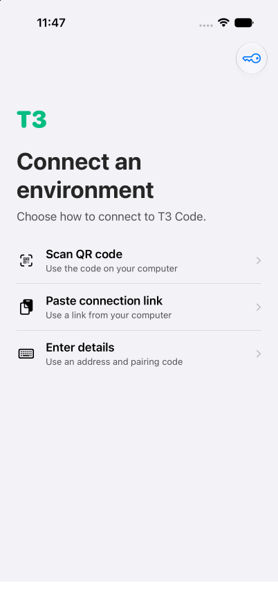

<p align="center">
  
</p>

# lct3

lct3 is a personal fork of [T3 Code](https://github.com/pingdotgg/t3code), built on the
SwiftUI iPhone client from T3 Code's own iOS rebuild branch
(`t3code/rebuild-mobile-app-swift`). It pairs to any T3 Code server and turns an agent
thread into a device IPA: it asks the server to build your project's iOS app, streams the
artifact to the phone, and runs it on-device through the LiveContainer runtime. Everything
else in T3 Code — the server, web app, desktop app, and the provider adapters — is here
too, kept current with upstream.

<p align="center">
  
  &nbsp;
  
</p>

## What it adds

- **Run iOS App from a thread.** Pick an Xcode project or a build recipe, and the server builds a
  device IPA with status streaming, a watchdog, and deterministic, content-addressed artifacts.
- **Self-contained signing.** T3 Code Live embeds SideStore: sign in with your Apple ID once and
  the app mints, stores, and renews its own signing certificate — no SideStore or AltStore install
  required. A manual `.p12` import (Settings → Signing Certificate) is available as an alternative.
- **On-device runtime.** Verifies artifact integrity (SHA-256), installs with rollback, and manages
  the signing certificate lifecycle inside the sideloaded Live app.
- **Resilient transfer.** Signed URLs with a chunked, resumable fallback for older servers.

## Install

There are no releases yet — build from source. You need a Mac with a current Xcode and iOS 17+.

The iPhone client ships in two flavors:

- **T3 Code Live** (`apps/swift-ios/LiveContainerOverlay/build-live-ipa.sh`) — the full app wrapped
  in a LiveContainer host with the embedded SideStore signer. One bundle ID, sideloads with any
  free-account signer (iLoader, SideStore, AltStore), and signs in with an Apple ID on first run.
- **Standard app** (`T3Code.xcodeproj`, below) — the plain SwiftUI client for App Store-style
  distribution. MIT-licensed, no LiveContainer code.

```bash
git clone https://github.com/ehfreema/lct3.git
cd lct3
sh apps/swift-ios/LiveContainerOverlay/build-live-ipa.sh   # T3 Code Live IPA
```

The Live IPA is unsigned by default; your signer re-signs it on install. Start a T3 Code server on
your machine (`npx t3@latest`), pair the phone over your network with the pairing URL, and sign in
with your Apple ID when the certificate sheet appears.

For day-to-day development and testing, run the Debug build on a simulator:

```bash
xcodebuild -project apps/swift-ios/T3Code.xcodeproj -scheme T3Code \
  -destination 'platform=iOS Simulator,name=iPhone 17 Pro' build
```

## Server and web

The T3 Code server, web app, and desktop app live in this repository and work as upstream:

```bash
vp i
vp run dev
```

## Documentation

- [Build and run an iPhone app](docs/user/run-ios-apps.md)
- [On-device runtime internals](docs/internals/ios-app-runtime.md)
- [Install and first run](docs/user/install.md) · [Remote access](docs/user/remote-access.md)
- Full docs live in [docs/](docs). The [upstream README](https://github.com/pingdotgg/t3code#readme)
  covers everything T3 Code does.

## About this fork

lct3 is a personal fork of T3 Code, MIT-licensed like upstream. Upstream attribution and the
original license remain in [LICENSE](LICENSE).

The iPhone runtime builds on [LiveContainer](https://github.com/LiveContainer/LiveContainer)
(AGPL-3.0, pinned commit in
[build-live-ipa.sh](apps/swift-ios/LiveContainerOverlay/build-live-ipa.sh)), and the embedded
signer is [SideStore](https://github.com/LiveContainer/SideStore) (AGPL-3.0, nightly pinned in the
same script). The [LiveContainerOverlay](apps/swift-ios/LiveContainerOverlay) sources are
LiveContainer-derived and stay under the GNU AGPL version 3 — the Live IPA is distributed together
with its corresponding source. Details in
[AGPL-NOTICE.md](apps/swift-ios/LiveContainerOverlay/AGPL-NOTICE.md). The standard SwiftUI
target contains no LiveContainer or SideStore code and keeps the MIT license.
